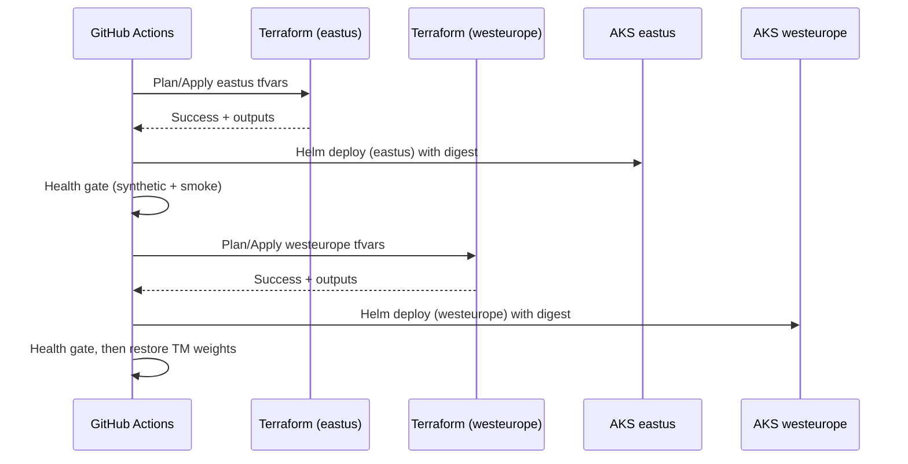

# Deployment & Runbook (Region-Isolated AKS)

## Pre-Reqs
- Terraform state backends per region (`tfstate/{env}/{region}/infra.tfstate`).
- GitHub Actions OIDC federations defined in infrastructure/environments/*-global.tfvars.
- Images published to ACR with immutable digests.

## Flow (per release)
1. Plan: `terraform plan -var-file=infrastructure/environments/{env}-eastus.tfvars` then westeurope; capture plans for approval in prod.
2. Apply (serial): eastus → health checks (App Gateway probe + `/healthz`) → westeurope.
3. Helm Deploy: per region using the built image digest; namespaces scoped per service.
4. Post-Deploy Verification: synthetic checks + smoke API tests; require green for 15m before promoting next region.
5. Traffic: adjust Traffic Manager weights during deploy (e.g., eastus 90%, westeurope 10%); restore steady-state 70/30 after success.
6. Rollback: use previous Helm release per region; keep Traffic Manager pinned to healthy region.

## Artifacts & Evidence
- Store plan/apply outputs, Helm diff, and test results in workflow summary (audit requirement).
- Record Key Vault secret version bumps per deploy.

## Operational Checks
- HPAs active; ingress rate limits; Key Vault CSI mounts healthy; managed identity bindings correct.
- Data planes sized per docs/design/scalability-strategy.md; alerts enabled.

## Deployment Sequence (diagram)

## References
- HLD: docs/design/hld.md
- LLD: docs/design/lld.md
- CI/CD: docs/design/ci-cd.md
- Scalability: docs/design/scalability-strategy.md
- Decisions: docs/decisions/
